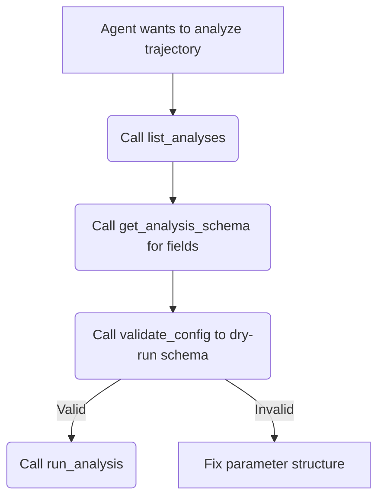

# MCP Server Integration

To allow AI agents (like Claude or other LLMs) to directly call `warp-md` tools, the package includes a Model Context Protocol (MCP) server. This exposes trajectory analysis, molecule packing, and peptide building as first-class tool definitions.


MCP is a standard protocol enabling LLMs to execute secure, structured tools on your local system. For details, see the [Model Context Protocol Specification](https://modelcontextprotocol.io).


---

## Setup & Configuration

To run the MCP server, make sure the `mcp` SDK is installed:

```bash
pip install "warp-md[mcp]"
```

### Claude Desktop Integration

To configure the server for Claude Desktop, edit your config file:
- **macOS**: `~/Library/Application Support/Claude/claude_desktop_config.json`
- **Windows**: `%APPDATA%\Claude\claude_desktop_config.json`
- **Linux**: `~/.config/Claude/claude_desktop_config.json`

Add the `warp-md` server entry under `mcpServers`:

```json
{
  "mcpServers": {
    "warp-md": {
      "command": "warp-md",
      "args": ["mcp"]
    }
  }
}
```

Restart Claude Desktop, and you will see a plug icon representing the registered tools.

---

## Registered MCP Tools

The server exposes seven tools covering the entire simulation pre- and post-processing pipeline:

### 1. `run_analysis`
Run molecular dynamics trajectory analyses on a given system and trajectory path.
- **Arguments**:
  - `system_path` (`str`): Path to the structure/topology file (PDB, GRO, mmCIF, etc.)
  - `trajectory_path` (`str`): Path to the trajectory file (XTC, DCD, TRR, etc.)
  - `analyses` (`list[dict]`): A list of analysis requests matching the plan schema (e.g. `[{"name": "rg", "selection": "protein"}]`)
  - `output_dir` (`str?`): Directory to write output array files
  - `device` (`str`): Compute device: `"auto"`, `"cpu"`, or `"cuda"`
  - `fail_fast` (`bool`): Stop execution immediately if any analysis fails

### 2. `list_analyses`
Get a list of all analysis types registered on the server.
- **Returns**: A list of string names (e.g., `["rg", "rmsd", "msd", "rdf", "dssp", ...]`).

### 3. `get_analysis_schema`
Retrieve the programmatic schema of required and optional fields for a specific analysis type.
- **Arguments**:
  - `name` (`str`): Analysis name (e.g. `"rdf"`)

### 4. `validate_config`
Validate an analysis batch configuration payload without executing it.
- **Arguments**:
  - `config` (`dict`): The full payload matching the `warp-md.agent.v1` schema.

### 5. `pack_molecules`
Build initial structures by packing molecules into boxes with GENCAN optimization.
- **Arguments**:
  - `config_path` (`str`): Path to a JSON, YAML, or Packmol `.inp` configuration file.
  - `output` (`str`): Path for the output coordinate file.
  - `format` (`str`): File format to write (PDB, GRO, mmCIF, CRD, MOL2, LAMMPS, XYZ).
  - `stream` (`bool`): Enable streaming progress events.

### 6. `build_peptide`
Construct peptide structures from amino acid sequences using internal coordinate geometry.
- **Arguments**:
  - `sequence` (`str?`): One-letter code sequence (e.g., `"ACDEFG"`).
  - `three_letter` (`str?`): Dash-separated three-letter sequence (e.g., `"ACE-ALA-VAL-NME"`).
  - `preset` (`str`): Secondary structure preset (`extended`, `alpha-helix`, `beta-sheet`, `polyproline`).
  - `oxt` (`bool`): Add terminal carboxyl oxygen.
  - `detect_ss` (`bool`): Enable automated disulfide detection.

### 7. `mutate_peptide`
Mutate residues in-place within an existing coordinate structure.
- **Arguments**:
  - `input` (`str`): Input structure file path.
  - `mutations` (`list[str]`): List of mutations formatted as `<from><pos><to>` (e.g. `["A5G", "C12S"]`).
  - `output` (`str`): Output structure file path.

---

## Agent Usage Pattern

When an agent needs to perform calculations, it can discover, validate, and execute in a safe loop:


